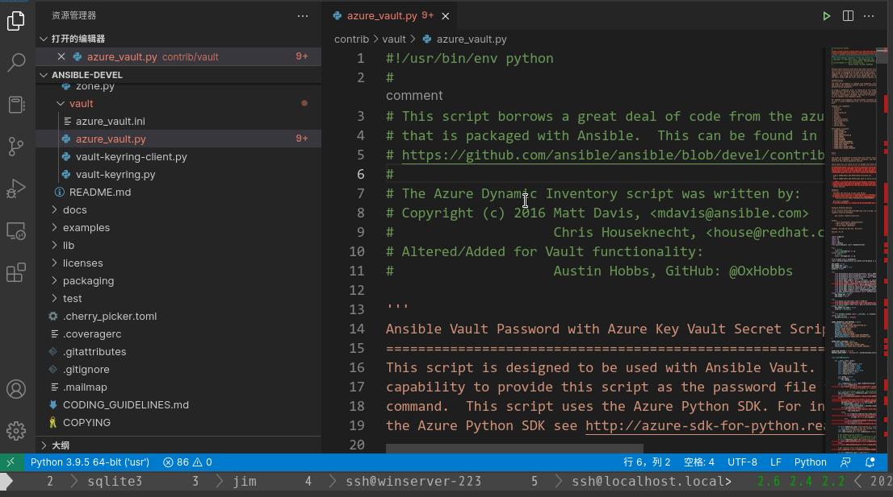

## Line note displayed in Codelens

Linenode-codelens store note in sqlite3 db under project's .vscode folder.It allow to manage notes in tree view like bookmarks, and it display notes as codelens in line.

This is inspired by **linenote**(https://github.com/tkrkt/linenote)

## Demo
### Tree view

### Create and delete note

### Move single note

### Move mutiple notes

