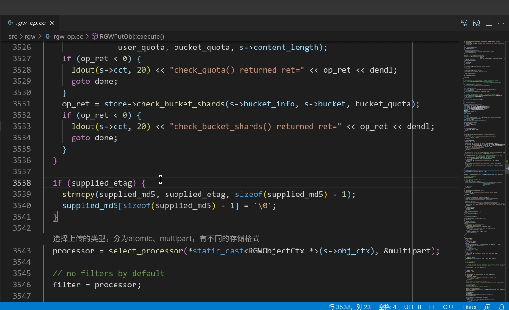
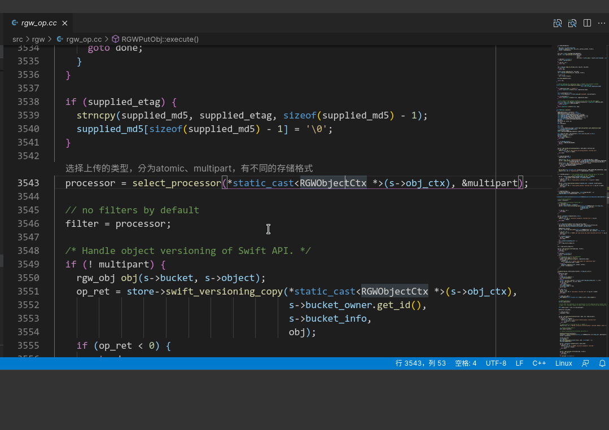
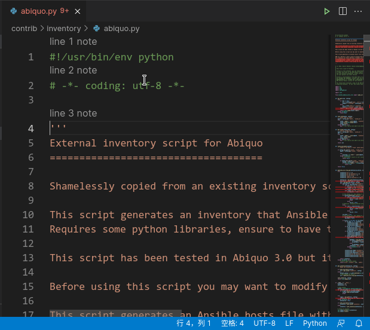

## Line note displayed in Codelens

This is inspired by line-note(https://github.com/tkrkt/linenote)

Line-node-codelens store note in sqlite3 db under project's .vscode folder, and allow to move note to target line.

## Demo
### Create and delete note

### Move single note

### Move mutiple notes

